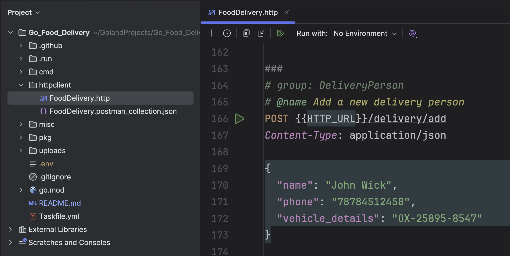

source: https://blog.jetbrains.com/go/2024/11/04/create-a-full-stack-app-with-go-and-react/

Windows, Go, Three.js


### Prerequisites

Before starting up this project, make sure you have the necessary dependencies installed in your machine.


###  Installation

- [x] [Go](https://go.dev/) - Go is an open source programming language that makes it simple to build secure, scalable systems.

- [x] [Three.js](https://threejs.org/manual/#en/installation) - Iprovements over p5.js


### Environment Variables

Be sure to place the `.env` file in the project root and update the information according to your settings. Refer to the example below.

```
APP_ENV=dev
DB_HOST=localhost
DB_USERNAME=postgres
DB_PASSWORD=*************
DB_NAME=food_delivery
DB_PORT=5432
STORAGE_TYPE=local
STORAGE_DIRECTORY=uploads
LOCAL_STORAGE_PATH=C:\Users\win10\GolandProjects\Go_Food_Delivery\uploads
UNSPLASH_API_KEY=*******************
JWT_SECRET_KEY=********************
PASSWORD_SALT=********************
```

### External APIs

We are using [UnSplash](https://unsplash.com/) to generate images. So, you need to have an API key to work with the application. 


### Frontend (UI)

To configure the application's frontend UI, be sure to follow the instructions in this [repository][repo].

[repo]: https://github.com/mukulmantosh/food_delivery_frontend


### HTTP Client

We have covered the APIs which you can directly test out from the IDE. 


